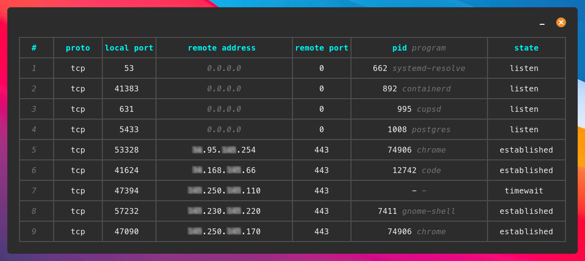

# 🌏 ⬅ somo ⬅ :man_technologist: 
### A prettier alternative to netstat or ss for socket monitoring.

---

## ⚙️ Features:
### 1. Pretty and easy readable table:


### 2. Filtering:
You can filter by **remote-port**, **IP**, **protocol**, **client program**, **PID** and **connection status**.
Check the flag descriptions below.

### 3. Process killing:
After inspecting your connections you can decide to kill a process using an interactive selection option.


### 4. Checking for malicious IPs using [AbuseIPDB.com](https://www.abuseipdb.com/):
To automatically check if any of the remote IPs you are connected to are malicious you can specify an API key for the AbuseIPDB API as an environment variable:
```bash
export ABUSEIPDB_API_KEY={your-api-key}
```
Adding the ``-k`` flag will then check for malicious IPs and notify you in the table:
###### TODO: add image

---

## 🚩 Flags:
| flag | description | value |
| :------------- |:------------- | ----- |
| ```--proto``` | filter by either TCP or UDP  | ``tcp`` or ``udp`` | 
| ```--ip``` | filter by a remote IP | the IP addressm e.g ``0.0.0.0`` |
| ```--port, -p``` | filter by a remote port | the port number, e.g ``443`` |
| ```--local-port``` | filter by a local port | the port number, e.g ``5433`` |
| ```--program``` | filter by a client program | the program name e.g ``chrome`` |
| ```--pid, -p``` | filter by a PID | the PID number, e.g ``10000`` |
| ```--open, -o``` | filter by open connections | - |
| ```--exclude-ipv6, -e``` | don't list IPv6 connections | - |
| ```--kill, -k``` | interactive process killing | - |
| ```--check, -c``` | check remote IPs using AbuseIPDB (make sure the environment variable ``ABUSEIPDB_API_KEY`` is set) | - |